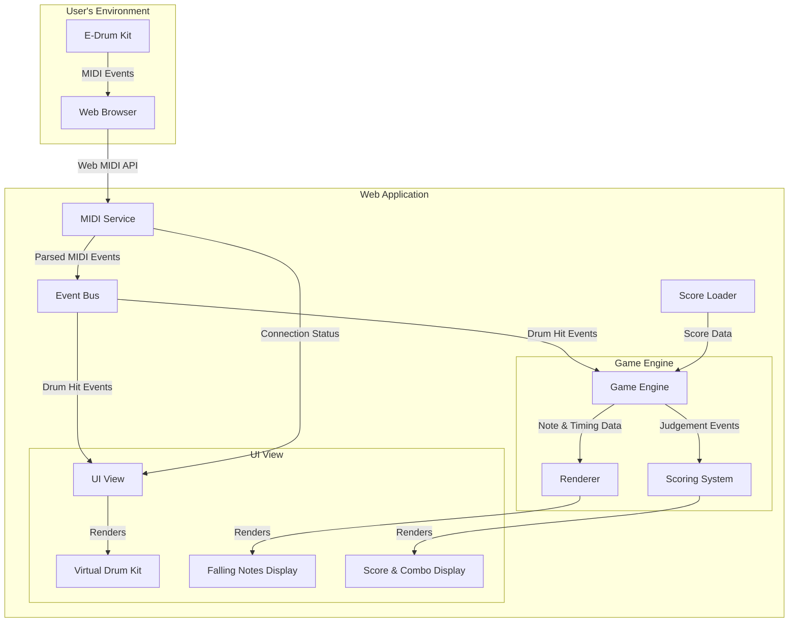

# E-Drum Practice App - System Architecture Design

## 1. Introduction

This document provides a high-level overview of the system architecture for the E-Drum Practice App. It defines the major components of the application, their responsibilities, and how they interact with each other. The architecture is designed to be modular, scalable, and focused on delivering a low-latency user experience for the MVP.

## 2. Architectural Principles

*   **Client-Side Logic:** The entire application logic will reside on the client-side (in the user's web browser). No backend server is required for the MVP, simplifying development and deployment.
*   **Modularity:** The application will be divided into distinct, loosely coupled modules, each with a single responsibility. This makes the codebase easier to understand, maintain, and test.
*   **Event-Driven:** The application will be heavily event-driven. MIDI events from the drum kit will trigger state changes and UI updates, and a central timing mechanism (game loop) will drive the score rendering and game state.

## 3. High-Level Architecture Diagram

The following diagram illustrates the main components of the system and the data flow between them.

## 4. Component Breakdown

### 4.1. MIDI Service (`midi_service.js`)
*   **Responsibility:** Manages all interactions with the Web MIDI API.
*   **Functions:**
    *   Requests MIDI access from the browser.
    *   Lists available MIDI input devices.
    *   Establishes and closes connections to a selected device.
    *   Listens for incoming MIDI messages (`noteOn`, `noteOff`).
    *   Parses raw MIDI messages into a structured format (e.g., `{ note: 60, velocity: 127, type: 'noteOn' }`).
    *   Publishes parsed events and connection status changes to the Event Bus.

### 4.2. Event Bus (`event_bus.js`)
*   **Responsibility:** A central pub/sub system for communication between different modules. This decouples the modules from each other.
*   **Functions:**
    *   `subscribe(eventName, callback)`: Allows a module to listen for a specific event.
    *   `publish(eventName, data)`: Allows a module to broadcast an event to all listeners.
*   **Key Events:** `midi:connected`, `midi:disconnected`, `midi:noteOn`, `game:start`, `game:noteHit`, `game:noteMiss`, `game:updateScore`.

### 4.3. UI View (`ui_view.js`)
*   **Responsibility:** Manages all rendering and user interactions with the DOM.
*   **Functions:**
    *   Renders the main application layout, including the virtual drum kit, score display area, and connection status panel.
    *   Subscribes to `midi:noteOn` events to trigger animations on the virtual drum kit.
    *   Subscribes to `game:updateScore` events to update the score and combo display.
    *   Handles user actions like clicking the "Connect" button.

### 4.4. Score Loader (`score_loader.js`)
*   **Responsibility:** Loads and parses drum score data.
*   **Functions:**
    *   Fetches a score file (e.g., `song.json`) using the `fetch` API.
    *   Parses the JSON data into an internal data structure that the Game Engine can understand.
    *   Provides an interface to get the score metadata (title, BPM) and the list of notes.

### 4.5. Game Engine (`game_engine.js`)
*   **Responsibility:** The core logic for the "Follow the Score" practice mode.
*   **Functions:**
    *   Initializes the game state with the loaded score data.
    *   Manages the main game loop (`requestAnimationFrame`) which controls the timing and progression of the game.
    *   Calculates the current position of falling notes based on the elapsed time and BPM.
    *   Subscribes to `midi:noteOn` events to process user input.
    *   Contains the **Judging Logic** to compare user hits against the score's notes.
    *   Publishes game events (`game:noteHit`, `game:noteMiss`) to the Event Bus.

### 4.6. Renderer (`renderer.js`)
*   **Responsibility:** Handles the rendering of the dynamic game elements, specifically the falling notes.
*   **Technology:** This could use HTML5 Canvas for optimal performance, or simple DOM element manipulation for the MVP.
*   **Functions:**
    *   Receives note positions from the Game Engine in each frame.
    *   Clears the canvas/display area and draws the notes in their new positions.

### 4.7. Scoring System (`scoring_system.js`)
*   **Responsibility:** Manages the player's score, combo, and accuracy.
*   **Functions:**
    *   Subscribes to `game:noteHit` and `game:noteMiss` events.
    *   Updates the score and combo based on the judgement result (e.g., Perfect, Good, Miss).
    *   Calculates overall accuracy.
    *   Publishes `game:updateScore` events with the new score information.

## 5. Technology Choices (MVP)

*   **Language:** Vanilla JavaScript (ES6+).
*   **Styling:** CSS3.
*   **Rendering:** DOM manipulation with CSS animations for simplicity. (Can be upgraded to Canvas later).
*   **Code Structure:** ES6 Modules to separate components into different files.