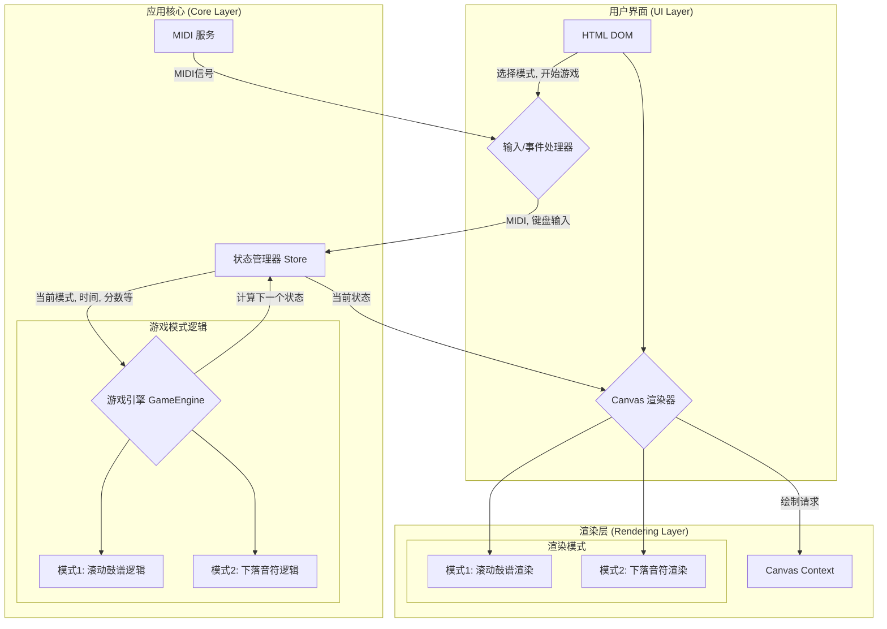

# 电子鼓练习应用重写计划

本文档旨在总结现有项目的架构和问题，并为下一版本的重构提供一个清晰的设计方案。重构的核心目标是 **提升性能和渲染效率**。

## 1. 现有项目总结

### 1.1. 核心功能

- **MIDI 输入处理**: 通过 Web MIDI API 接收电子鼓的 MIDI 信号。
- **乐谱显示**: 使用 VexFlow 库渲染静态的鼓谱。
- **游戏逻辑**: 项目当前实现了单一的 **下落音符模式**。
- **实时反馈**: 根据用户的打击，提供实时（Hit/Miss）和视觉反馈。
- **计分系统**: 简单的分数和连击（Combo）统计。

### 1.2. 新增需求：双游戏模式

重构后的项目需要支持两种核心游戏模式：

1.  **模式一：滚动鼓谱模式 (Taiko-style)**
    *   **机制**: 预渲染的 VexFlow 鼓谱在屏幕上水平滚动，玩家需在音符到达固定判定线时击打。
    *   **目标**: 侧重于读谱和节奏的准确性。

2.  **模式二：下落音符模式 (Rhythm Game-style)**
    *   **机制**: 音符从屏幕顶部下落至底部判定线。
    *   **目标**: 侧重于反应速度和动态视觉反馈。

### 1.2. 技术栈

- **前端**: 原生 JavaScript (ES6 Modules)，没有使用任何现代前端框架。
- **构建工具**: Vite 用于开发服务器和项目构建。
- **乐谱渲染**: VexFlow.js。
- **依赖管理**: npm。

### 1.3. 架构分析

项目采用模块化的原生 JS 编写，职责划分如下：

- `main.js`: 应用入口，负责初始化和协调各个模块。
- `midi_service.js`: 封装 Web MIDI API，处理设备连接和消息接收。
- `game_engine.js`: 核心游戏循环，处理音符的生成、移动、命中判断和状态管理。
- `renderer.js`: 负责在 DOM 上生成和更新下落的音符元素。
- `vexflow_renderer.js`: 负责使用 VexFlow 渲染静态乐谱。
- `scoring_system.js`: 管理分数和连击数。
- `ui_controller.js`: 更新 UI 元素，如分数、按钮状态和视觉效果。
- `config.js`: 存放全局配置，如音符速度。
- `dom_elements.js`: 集中管理所有 DOM 元素的选择器。

### 1.4. 性能瓶颈与问题分析

1.  **渲染效率**:
    *   **DOM 操作过多**: 游戏循环 (`gameLoop`) 中，通过 `requestAnimationFrame` 对每一个活动的音符 DOM 元素进行位置更新 (`noteContainer.style.left`)。当音符数量增多时，频繁的 DOM 操作会导致浏览器重绘（repaint）和回流（reflow），严重影响性能，可能导致动画卡顿。
    *   **双重渲染**: 项目同时使用了 VexFlow 渲染静态乐谱和自定义的 DOM 元素来渲染下落的音符。这两种渲染方式没有很好地结合，增加了渲染的复杂性和潜在的性能开销。

2.  **可扩展性**:
    *   **紧密耦合**: 模块之间存在较强的耦合。例如，`game_engine.js` 直接调用 `renderer`, `scoring`, `ui` 模块的函数，使得更换或修改其中任一模块都变得困难。
    *   **状态管理混乱**: 游戏状态（如 `gameRunning`, `startTime`, `activeNotes`）散布在 `game_engine.js` 的顶层，缺乏一个集中式的状态管理机制，难以跟踪和调试。

3.  **可维护性**:
    *   **原生 DOM 依赖**: 大量代码直接依赖于 `dom_elements.js` 中获取的 DOM 节点，使得代码与 HTML 结构强绑定，不易于重构和测试。

## 2. 新版本设计方案

为了解决上述问题，新版本将采用更现代、性能更高的架构。

### 2.1. 核心设计思想：拥抱 Canvas

放弃基于 DOM 的音符动画，将整个游戏区域（包括下落的音符、判定线、背景等）的渲染迁移到 `<canvas>` 上。

**优势**:

- **极致性能**: Canvas 提供了底层的 2D 绘图 API，所有图形都在一个画布上绘制。相比于操作大量独立的 DOM 元素，单 Canvas 的渲染性能要高出几个数量级，可以轻松应对大量音符的场景，彻底解决 DOM 操作带来的性能瓶颈。
- **渲染统一**: VexFlow 本身就可以渲染到 Canvas 上。我们可以将静态乐谱和动态的下落音符绘制在同一个或分层的 Canvas 上，实现渲染逻辑的统一。
- **像素级控制**: Canvas 提供了更精细的控制能力，便于实现更复杂的视觉效果，如粒子效果、渐变、精确的碰撞动画等。

### 2.2. 新架构设计 (支持多模式)

新架构的核心是灵活性，能够轻松支持并切换不同的游戏模式。

**数据流说明**:

1.  用户通过 UI 选择游戏模式。
2.  `状态管理器` 中记录当前激活的模式。
3.  `游戏引擎` 根据当前模式，调用对应的逻辑模块（`滚动逻辑` 或 `下落逻辑`）来计算状态。
4.  `Canvas 渲染器` 根据当前模式，调用对应的渲染模块（`滚动渲染` 或 `下落渲染`）来绘制画面。

### 2.3. 模块职责重定义

1.  **状态管理器 (State Manager)**:
    *   **职责**: 成为应用唯一的“事实来源”（Single Source of Truth）。集中管理所有共享状态，如 `gameMode` (当前游戏模式), `isRunning`, `currentTime`, `score`, `combo`, `notes` 等。
    *   **实现**: 可以是一个简单的发布/订阅模式的 `Store` 对象。
    *   **优势**: 状态变更可预测、可追踪，模块间解耦，逻辑更清晰。

2.  **游戏引擎 (Game Engine)**:
    *   **职责**: 作为总控制器，根据 `state.gameMode` 来调用不同的游戏逻辑子模块。它本身不包含具体模式的逻辑，只负责调度。
    *   **子模块**:
        *   `scroll_mode_logic.js`: 计算滚动模式下鼓谱的位置、判定逻辑。
        *   `falling_mode_logic.js`: 计算下落模式下音符的位置、判定逻辑。
    *   **优势**: 逻辑与视图分离，且不同游戏模式的逻辑也相互独立，易于扩展新模式。

3.  **Canvas 渲染器 (Canvas Renderer)**:
    *   **职责**: 唯一的渲染出口。订阅状态管理器的更新，根据 `state.gameMode` 调用不同的渲染子模块。
    *   **实现**:
        *   **分层 Canvas**: 可以使用多个 Canvas 叠加。一个底层 Canvas 用于绘制不常变化的静态乐谱（由 VexFlow 绘制），一个上层 Canvas 用于每帧重绘的动态元素（下落音符、判定线、打击效果）。这样可以避免每帧都重绘静态乐谱，进一步提升性能。
    *   **优势**: 渲染逻辑集中，性能高，易于优化。

4.  **MIDI 服务 / 输入处理器**:
    *   **职责**: 保持不变，但不再直接调用 `game_engine` 或 `ui_controller`。而是将接收到的 MIDI 信号或键盘事件，转换为标准化的“动作”（Action），并派发（dispatch）给状态管理器。
    *   **优势**: 输入处理与游戏逻辑解耦。

### 2.4. 实施计划

1.  **搭建基础架构**:
    *   创建 `state_manager.js` 模块。
    *   创建 `canvas_renderer.js` 模块，并初始化 Canvas 环境。
2.  **重构游戏引擎**:
    *   移除所有 DOM 操作和对 `renderer`、`ui_controller` 的直接调用。
    *   改造 `gameLoop`，使其成为纯粹的状态计算函数。
3.  **实现 Canvas 渲染**:
    *   在 `canvas_renderer.js` 中实现绘制下落音符的逻辑。
    *   集成 VexFlow，使其渲染到背景 Canvas 上。
4.  **连接所有模块**:
    *   重写 `main.js`，按照新的数据流（输入 -> 状态 -> 渲染）来初始化和连接所有模块。

通过这次重构，我们将获得一个高性能、高可扩展性、易于维护的全新应用架构，为未来添加更复杂的功能（如多轨道、变速、更丰富的视觉效果）打下坚实的基础。